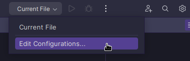
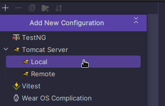
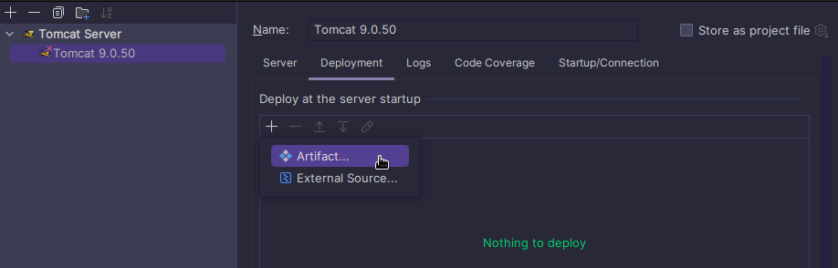
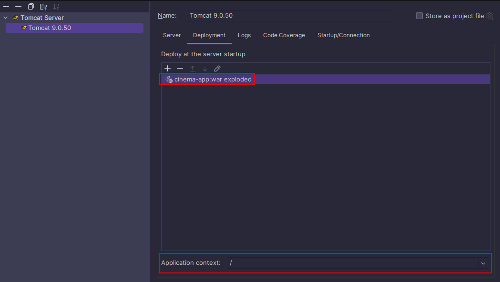
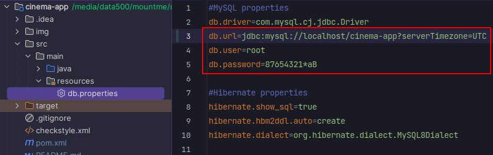
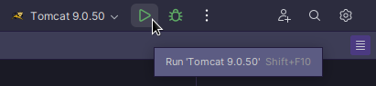

# Cinema App

## Table of contents:
1. [Project description](#project-description)
2. [Functionalities](#functionalities)
3. [Project structure](#functionalities)
4. [API](#api)
5. [Database structure](#database-structure)
6. [Technologies used](#technologies-used)
7. [Installation](#installation)

## Project description

This is a backend web application which implements a ticket reservation system in a cinema and
provides services such as authorization, new user registration, ordering tickets etc. via RESTful
API.

## Functionalities

  ### Key features available via RESTful API:
  - Register:
    - Allows to register as new users.

  - Authorization:
    - Authorizes users based on their roles (ADMIN or USER).

  - Managing application content:
    - Allows to create and read cinema halls.
    - Allows to create and read movies.
    - Allows to create, update, delete and read movie sessions.
    - Allows to read users by emails.

  - Main usage:
    - Adding a movie sessions to the shopping cart.
    - Completing the order.
    - Reading content of the user's shopping cart.
    - Reading the list of the user's orders.
    - Reading the list of available movie sessions by movie ID and a date.

## Project structure

This application consist of three layers:

1. Controller:
   Handles incoming requests from users or clients.
   Routes requests to appropriate service methods and prepares data for presentation.

2. Service: Contains business logic and application-specific rules.
   Acts as an intermediary between the DAO layer and the Controller layer.

3. DAO: Responsible for handling database operations.
   Uses JDBC (Java Database Connectivity) to interact with the database.
   Focuses on data retrieval, storage, and manipulation.

## API

- ### Endpoints accessible to any users (including unauthorized ones):

    - **POST**: `/register` - creates a new user.
      - Accepts json object with fields _**email**_, _**password**_, _**repeatPassword**_.
      - Returns json object with fields **_id_** and _**email**_.

- ### Endpoints accessible to users with `ADMIN` role:

    - **POST**: `/cinema-halls` - creates a new cinema hall.
        - Accepts json object with fields: **_capacity_** and **_description_**.
        - Returns json object with fields: _**id**_, _**capacity**_, _**description**_.

    - **POST**: `/movies` - creates a new movie.
        - Accepts json object with fields: _**title**_ and _**description**_.
        - Returns json object with fields: _**id**_, _**title**_ and _**description**_.

    - **POST**: `/movie-sessions` - creates a new movie session.
        - Accepts json object with fields: _**movieId**_, _**cinemaHallId**_, _**showTime**_ (with value of string
          with date and time in a format like this: "_2023-07-25T23:00:00_").
        - Returns json object with fields: _**movieSessionId**_, _**movieId**_, _**movieTitle**_, _**cinemaHallId**_,
          showTime (in format _[yyy,MM,dd,hh,mm]_).

    - **PUT**: `/movie-sessions/{id}` - updates info of movie session with id specified in URL: {id} (
      for example: /movie-sessions/2).
        - Accepts json object with fields: _**movieId**_, _**cinemaHallId**_, _**showTime**_ (with value of string
          with date and time in a format like this: _"2023-07-25T23:00:00"_).
        - Returns json object with fields: _**movieSessionId**_, _**movieId**_, _**movieTitle**_, _**cinemaHallId**_,
          _**showTime**_ (in format _[yyyy,MM,dd,hh,mm]_).

    - **DELETE**: `/movie-sessions/{id}` - deletes movie session with id specified in URL: {id} (for
      example: /movie-sessions/2).

    - **GET**: `/users/by-email` - returns user info by email.
        - Accepts GET request with parameters: _**email**_.
        - Returns json object with fields: _**id**_, _**email**_.

- ### Endpoints for users with `USER` role

    - **GET**: `/orders` - returns list of orders of authenticated user.
        - Each order in list has such fields: _**id**_ (order's ID), _**ticketIds**_ (list of tickets' IDs),
          _**userId**_ (user's ID), _**orderTime**_ (order's date and time).

    - **POST**: `/orders/complete` - completes the current authenticated user's order.
        - Returns json object with fields: _**id**_ (order's ID), _**ticketIds**_ (list of tickets' IDs),
          _**userId**_ (user's ID), _**orderTime**_ (order's date and time).

    - **PUT**: `/shopping-carts/movie-sessions` - adds a movie session to a shopping cart.
        - Accepts request with parameters: _**movieSessionId**_.

    - **GET**: `/shopping-carts/by-user` - returns current authenticated user's shopping cart.
        - Returns json object with fields: _**userId**_, _**ticketIds**_ (list of tickets' IDs).
    -
- ### Endpoints accessible to users with either the `USER` or `ADMIN` role.

    - **GET**: `/cinema-halls` - returns the list of all the cinema halls.
        - Each cinema halls in the list has such fields: _**id**_, _**capacity**_, _**description**_.

    - **GET**: `/movies` - returns the list of all the movies.
        - Each movie in the list has such fields: _**id**_, _**title**_, _**description**_.

    - **GET**: `/movie-sessions/available` - Returns the list of all available movie sessions for a
      specific movie on a particular date.
        - Accepts GET request with parameters: _**movieId**_, _**date**_ (with value's format _"dd.MM.yyyy"_).
        - Returns list of movie sessions. Each movie session has fields: _**movieSessionId**_, _**movieId**_,
          _**movieTitle**_, _**cinemaHallId**_, _**showTime**_ (in format _[yyyy,MM,dd,hh,mm]_).

## Database structure:

## Technologies used:

- Apache Tomcat 9.0.50
- Apache Maven 3.9.1
- Java 17
- MySQL 8.0.22
- Hibernate 5.6.14.Final
- JDBC
- Spring Core 5.3.20
- Spring Web 5.3.20
- Spring Security 5.6.10

## Installation:

To launch the project you should follow following steps:
1. You should have `MySQL` version `8.x.x` installed on your computer (you can download it here: [MySQL downloads](https://www.mysql.com/downloads/))
2. Also, you should have `Apache Tomcat` version `9.0.50` installed on your computer (you can download it here: [Tomcat 9.0.50](https://archive.apache.org/dist/tomcat/tomcat-9/v9.0.50/bin/))
3. Clone this repository to your local computer.
4. Open the project folder in `Intellij IDEA` IDE.
5. Set up the configuration for `Tomcat`.

   

   

   

   

6. Create a new empty schema in `MySQL` with such a name which is specified in `db.properties` file in `db.url` property (see below).
7. Go to the `db.properties` file which you can find in `resources` directory and replace values of `db.url`, `db.user` and `db.password` properties with the appropriate ones for your MySQL server:

   

8. Start Tomcat:

   

9. To use this application it's recommended to install [Postman](https://www.postman.com/) application. Postman allows you to create and send HTTP-requests. For sending HTTP-request you can use http://localhost:8080/ address and for first authorization you should use Basic Auth method in Postman with following parameters: username: `admin@i.ua`, password: `admin123` (`admin@i.ua` - this is the ADMIN user created by default during the cinema-app start).
